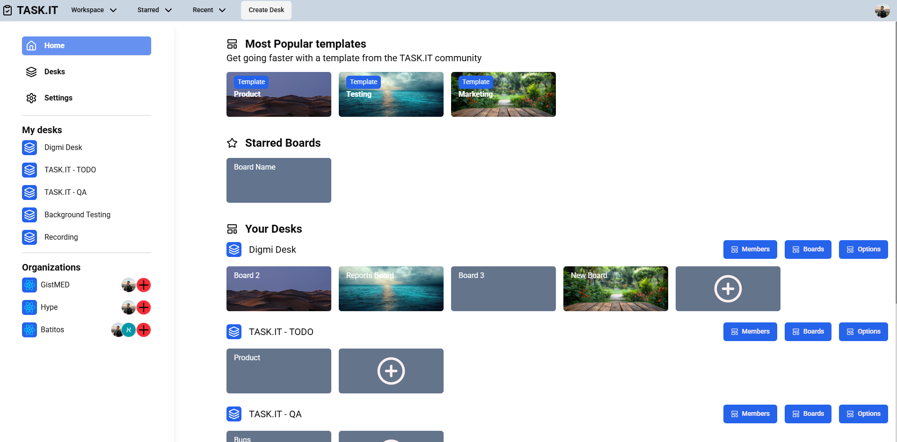
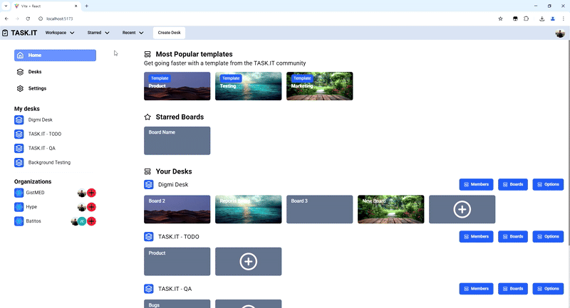
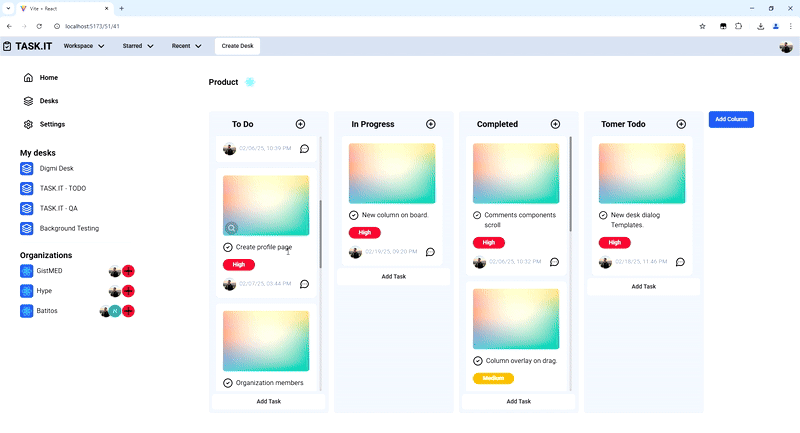
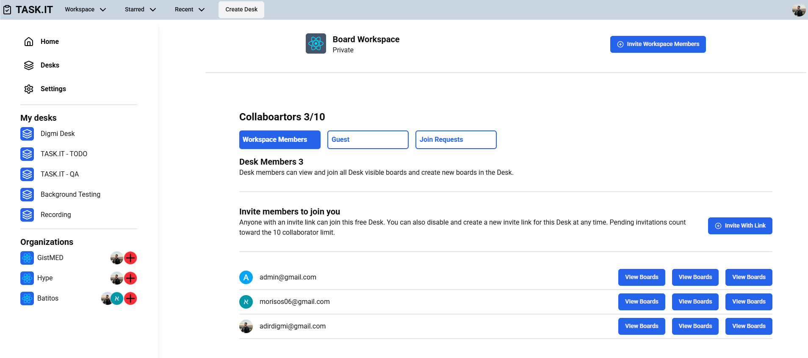

# TASK.IT – A Social Task Management App to Organize Your Team.

TASK.IT is a task management web application designed to help users efficiently organize their work. Inspired by Trello, it allows users to create boards, add columns, and manage tasks through a drag-and-drop interface.

In this project, I aimed to implement a seamless and intuitive user experience using React and Node.js. Key features include Google authentication, real-time task updates, and the ability to collaborate with others by inviting them via email (Future feature). Through this app, I successfully integrated `react-dnd` for smooth drag-and-drop functionality, optimized backend performance with Sequelize, and enhanced security with authentication mechanisms.

TASK.IT makes task management effortless, empowering teams to collaborate and stay productive. 🚀

## Home page:

## Create Desk - (with template):

## Add new task:

## Manage desk/organiztion members:

